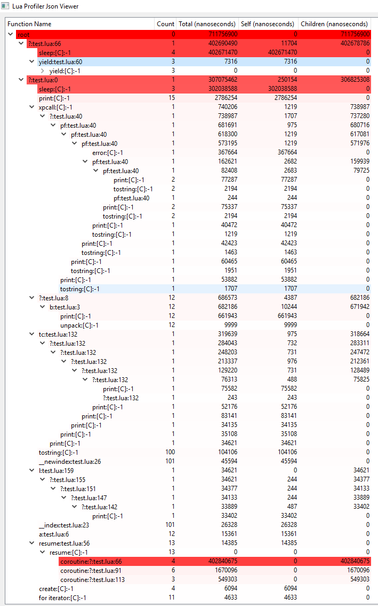

# LuaProfiler
Lua function call duration profiler in c++.

Target version : lua 5.3

## Build

### prerequisite
* compiler support c++17 
* cmake
* vcpkg
    - fmtlib
    - rapidjson
    - lua

Add this below to settings in vscode to link deps library as static:
```json
"cmake.configureArgs": [
        "-DVCPKG_TARGET_TRIPLET=x64-windows-static"
    ],
```
click Configure button or use cmake command line tool:

```sh
mkdir build
cd build
cmake .. -G "Visual Studio 15 2017 Win64" -DVCPKG_TARGET_TRIPLET=x64-windows-static

```

### build

In vscode with cmake extension just press `F7`.

or

```sh
mkdir build
cmake --build ./build --config MinSizeRel --target libLuaProfiler
```

## Integrate

1. Link libLuaProfiler to your project.
2. Include or copy content `lua_profiler.h`.
3. Openlib with code at startup : `luaopen_profiler(L);`.
4. require and use function in lua.

```lua
local luaprofiler = require("luaprofiler")

--[[
    start profile by set hook
    should call it best outside (before function call)
    what you want to profile
]]--
luaprofiler.start() 

--[[
     stop profile with remove hook
     should call it best outside (after function return)
     what you want to profile
]]--
luaprofiler.stop()

--[[
    clear all data
    should call it after report
]]--
luaprofiler.clear() 

--[[ 
    **deprecated**
    report profiling result in string
    should print or log or save it to file
]]--
-- luaprofiler.report_tree()
-- luaprofiler.report_list()

--[[ 
    report profiling result to file
    it will save it at the current working directory
    the first part of file name is timestamp
]]--
luaprofiler.report_to_file("json")
-- *.lua_profile_json.txt
luaprofiler.report_to_file("list")
-- *.lua_profile_list.txt
luaprofiler.report_to_file("tree")
-- *.lua_profile_tree.txt

```

## Json viewer


### Create standalone gui executable

```sh
pyinstaller json_viewer_main.py -w -F 
```

### Usage

#### Load json file

just drag `*.lua_profile_json.txt` to main window.

>Tips: Installing `everything` on windows helps to find files instantly.

#### Expand stack
1. click on the arrow to expand/fold stack
2. double click to expand the first child recursively
3. double click to fold

